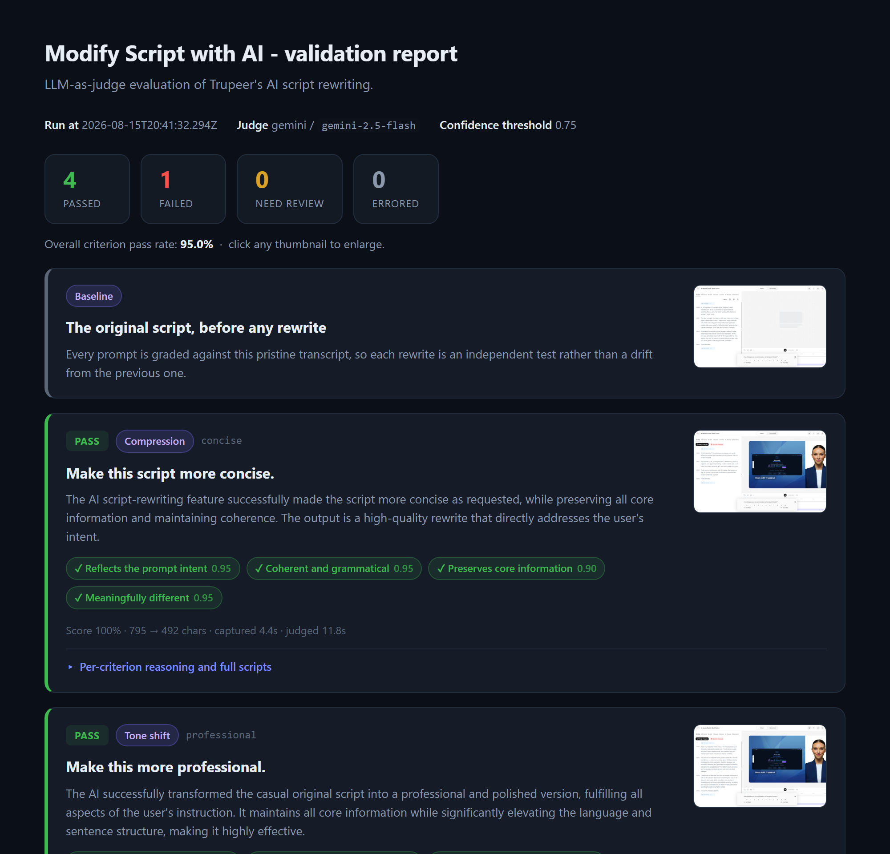
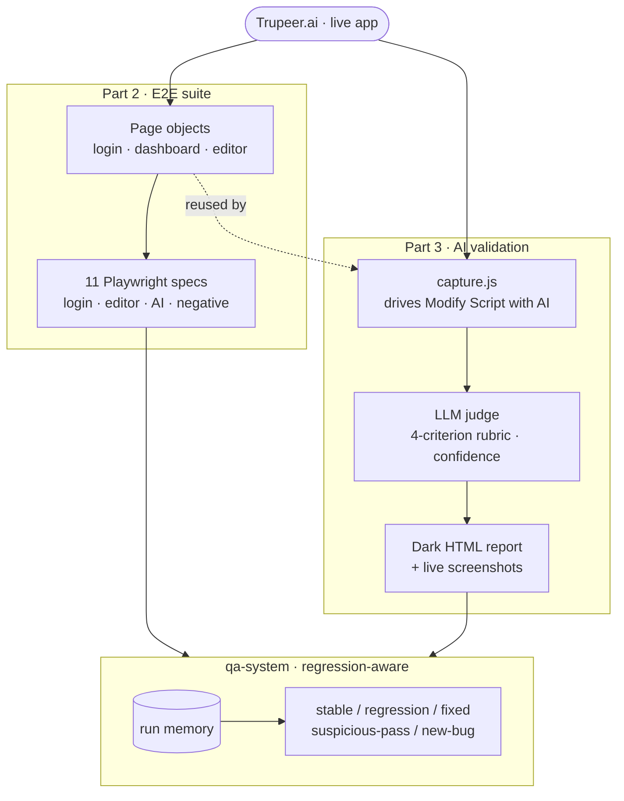
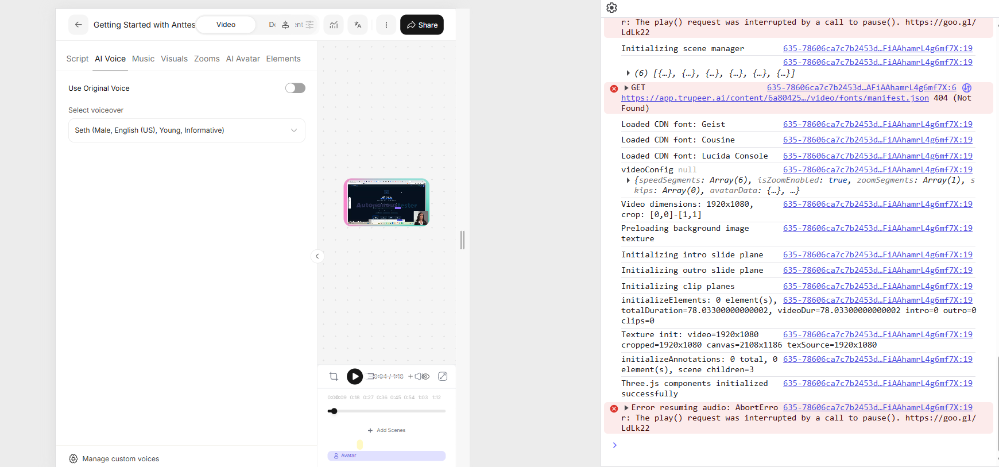
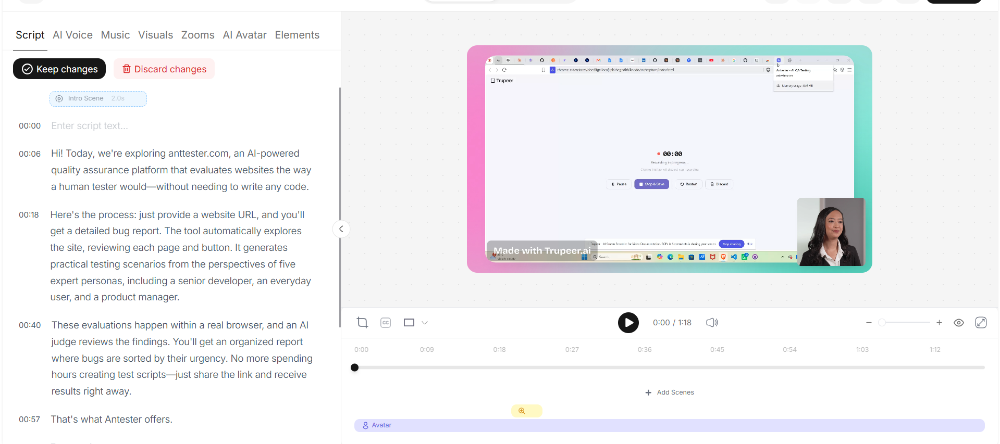
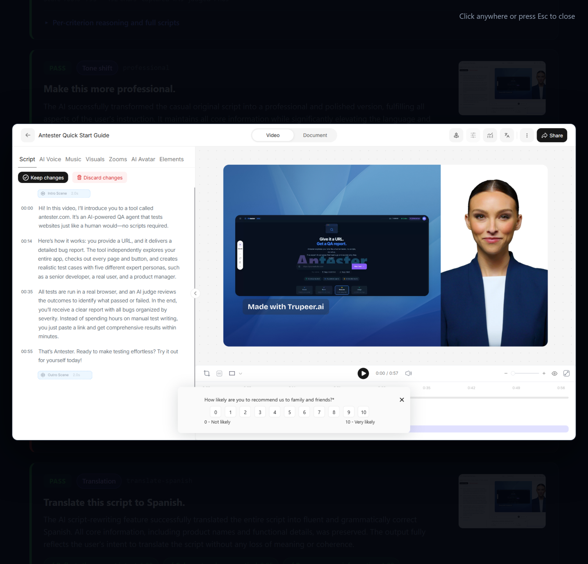
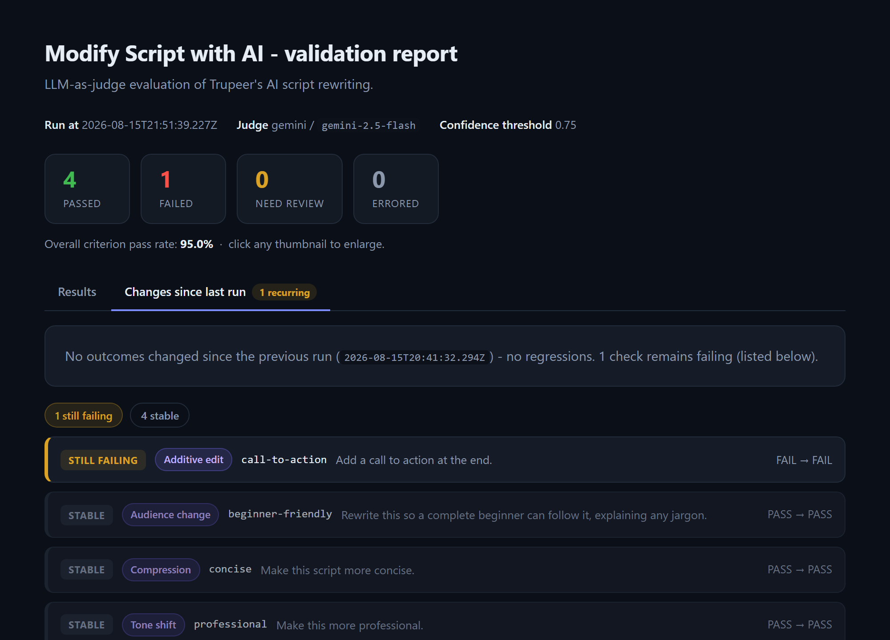

<h1 align="center">Trupeer.ai · QA Engineer Assignment</h1>

<p align="center">
  Exploratory testing, a Playwright E2E suite, and an <b>LLM-as-judge</b> harness that
  grades Trupeer's "Modify Script with AI" against a rubric - plus a regression-aware
  QA system that remembers every run.
</p>

<p align="center">
  
  
  
  
  
</p>

<p align="center">
  
  <br/>
  <em>Part 3's report: every prompt graded live, each verdict backed by a screenshot you click to enlarge.</em>
</p>

---

## What's here

| Part | Folder | What it is |
| :--- | :--- | :--- |
| 1 | [`part1/`](part1/) | Exploratory testing session and a bug report with reproducible evidence |
| 2 | [`part2/`](part2/) | Playwright E2E suite (Page Object Model), 11/11 passing against live Trupeer |
| 3 | [`part3/`](part3/) | LLM-as-judge validation harness for "Modify Script with AI" |
| ✦ | [`qa-system/`](qa-system/) | A regression-aware QA system that ties it together and remembers what changed |

Beyond the three required parts, [`qa-system/`](qa-system/) is the piece meant to
stand out. A normal suite reports today's pass rate; this one remembers prior runs,
classifies each check as **stable / regression / fixed / suspicious-pass / new-bug**,
explains regressions from an evidence diff, routes model work by cost (a strong model
for judgment, Gemini Flash for cheap vision), runs read-only security probes, and emits
a self-contained HTML report that opens automatically. The rationale is in
[`docs/PLAN.md`](docs/PLAN.md).

## How it fits together



Part 3 imports Part 2's page objects rather than re-implementing login and the editor,
so there is one source of truth for every selector.

## Quick start

```bash
# Part 2 - E2E suite
cd part2
npm install
npx playwright install chromium
cp .env.example .env      # fill in Trupeer credentials
npm run auth              # one-time: capture a logged-in session
npx playwright test       # report opens in the browser automatically

# Part 3 - AI-augmented validation
cd ../part3
npm install
cp .env.example .env      # add a free GEMINI_API_KEY (or an ANTHROPIC_API_KEY)
npm run validate          # grades 5 prompts, opens the HTML report
```

**Prerequisites:** Node.js 20+, a Trupeer account with **one recorded video that has a
generated script** (record with the mic enabled), and one judge API key for Part 3
(a free [Gemini key](https://aistudio.google.com/app/apikey) is enough).

Full setup, environment variables, and troubleshooting live in each part's README:
[`part2/README.md`](part2/README.md) · [`part3/README.md`](part3/README.md) ·
[`part3` sample report](part3/results/latest.html).

## Highlights

**Part 1 - evidence, not assertions.** Every bug has a reproducible screenshot. A few:

<table>
  <tr>
    <td width="50%" valign="top">
      <a href="part1/evidence/manifest-404/">
        
      </a>
      <sub><b>BUG-1</b> · <code>video/fonts/manifest.json</code> 404s on every editor load</sub>
    </td>
    <td width="50%" valign="top">
      <a href="part1/evidence/empty-prompt/">
        
      </a>
      <sub><b>BUG-2</b> · a whitespace-only prompt is accepted and rewrites the script</sub>
    </td>
  </tr>
</table>

The full report, including a no-content-moderation finding, is in
[`part1/bugs.md`](part1/bugs.md).

**Part 3 - an LLM judge that actually catches things.** The report above shows 4/5 prompts
passing. The one **FAIL** is the point: asked only to *add a call to action*, the feature
rewrote the whole script, which the judge caught on the "reflects the prompt intent"
criterion - a nuance a string-match assertion cannot see. Click any thumbnail and it
expands:

<p align="center">
  
</p>

Re-run it and the numbers change, because every rewrite is a live Trupeer call graded by
a live judge - nothing is hardcoded.

**Both suites remember the last run and report what changed.** Each report has a
**Changes since last run** tab that compares this run to the previous one and classifies
every check as **regression** (was passing, now failing), **fixed**, **new**,
**still-failing** (recurring), or **stable** - the same run-over-run memory the
[`qa-system/`](qa-system/) is built around, brought into Part 2 and Part 3 directly. A
persistent failure surfaces as an orange badge on the tab:

<p align="center">
  
  <br/>
  <em>Part 3's real committed run: one recurring failure, four stable. When a check regresses it appears first, in red - Part 2's Playwright suite gets the same view via a custom reporter.</em>
</p>

## Design notes

**Credentials are never committed.** Everything sensitive is read from `.env` files, which
are gitignored; `.env.example` documents each variable.

**Authentication is captured once, reused everywhere.** Trupeer's sign-in is slow and
brittle to drive on every test, so both parts log in once, persist the browser storage
state to `part2/.auth/user.json`, and reuse it. See
[`part2/README.md`](part2/README.md#authentication).

**Selectors are centralised and layered.** Every selector lives in a page object under
`part2/src/pages/`; no test file contains a CSS or XPath string. Each locator is an ordered
list of strategies (role -> test id -> text), so a single markup change usually does not
break the suite. See [`part2/src/utils/locators.js`](part2/src/utils/locators.js).

**The judge is provider-agnostic.** It uses a free Gemini key by default and falls back to
a second provider if the first is unavailable; the rubric, scoring, and report are identical
whichever runs. See [`part3/README.md`](part3/README.md).
