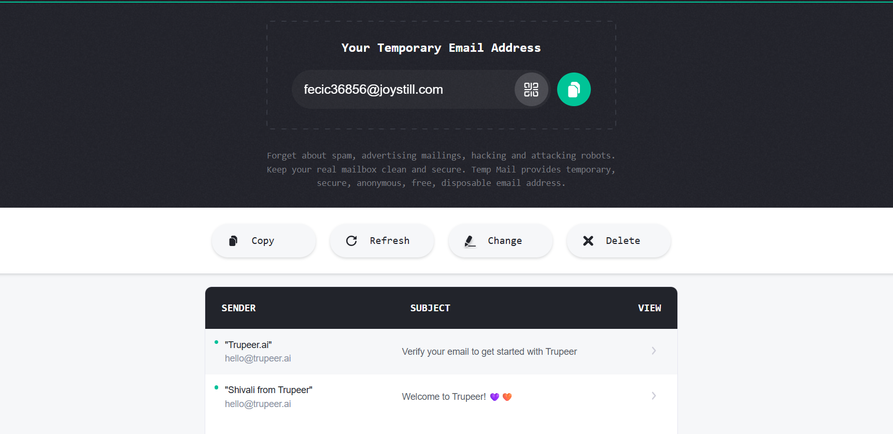

# Evidence: OBS-2 - sign-up accepts disposable / temporary email

Trupeer's sign-up accepts a throwaway temp-mail address and delivers its
verification email to it, so email verification does not stop a user from
spinning up unlimited free accounts (each with a fresh video allowance).

The disposable inbox `fecic36856@joystill.com` received both Trupeer's
verification email and the welcome email, confirming the throwaway address
satisfied verification.
