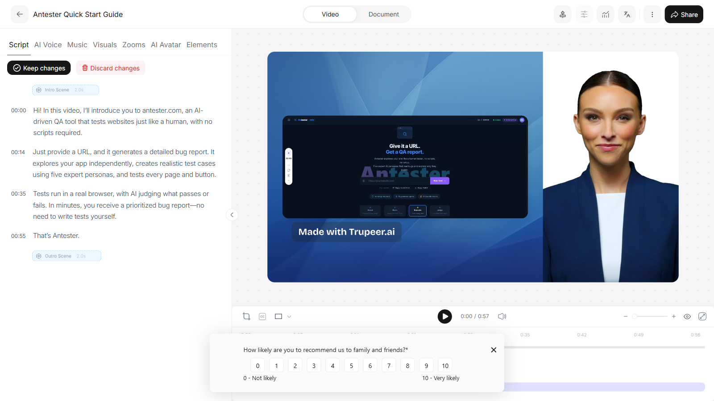
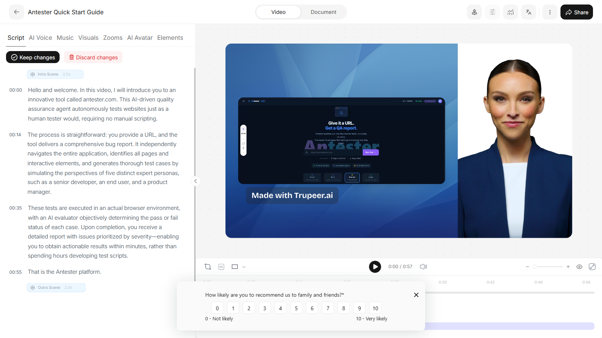
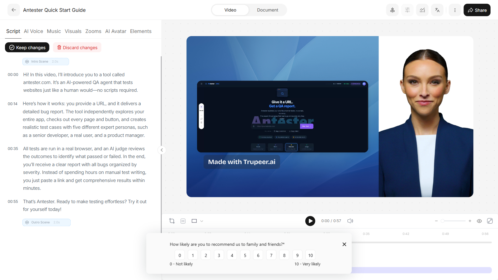
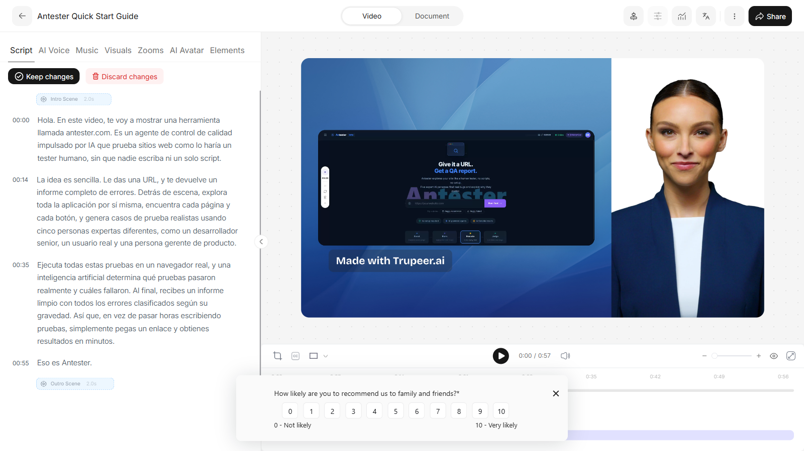
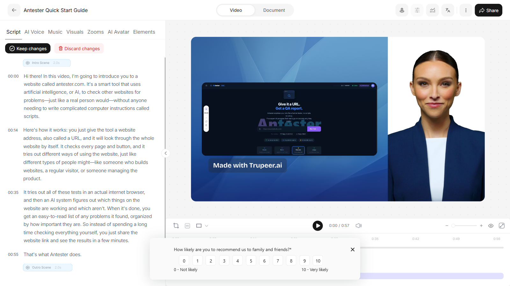

# Modify Script with AI - validation run

- **Run at:** 2026-08-15T20:41:32.294Z
- **Judge:** gemini / `gemini-2.5-flash`
- **Confidence threshold:** 0.75
- **Result:** 4 passed, 1 failed, 0 need review, 0 errored
- **Overall criterion pass rate:** 95.0%

## Summary

| Prompt | Outcome | Score | Failed criteria | Low-confidence criteria |
| :--- | :--- | :--- | :--- | :--- |
| `concise` | PASS | 100% |  -  |  -  |
| `professional` | PASS | 100% |  -  |  -  |
| `call-to-action` | FAIL | 75% | Reflects the prompt intent |  -  |
| `translate-spanish` | PASS | 100% |  -  |  -  |
| `beginner-friendly` | PASS | 100% |  -  |  -  |

## `concise` - PASS

**Prompt:** Make this script more concise.

**Intent:** The output should be meaningfully shorter than the original while keeping every substantive point. Cutting filler and redundancy is correct; dropping a distinct fact or step is not.

| Criterion | Verdict | Confidence | Reasoning |
| :--- | :--- | :--- | :--- |
| Reflects the prompt intent | pass | 0.95 | The modified script successfully condenses the original content, resulting in a significantly shorter version while retaining the key message. This directly aligns with the user's instruction to make the script more concise. |
| Coherent and grammatical | pass | 0.95 | The modified script is well-structured, grammatically correct, and flows naturally, making it easy to understand. |
| Preserves core information | pass | 0.90 | All substantive facts and steps from the original script are retained in the modified version. Details and filler words have been removed, but no distinct piece of information essential to understanding Antester.com's function or benefits has been lost. |
| Meaningfully different | pass | 0.95 | The modified script is a genuine rewrite, demonstrating substantial changes in phrasing and structure to achieve conciseness, rather than just swapping a few words or punctuation marks. |

**Overall:** The AI script-rewriting feature successfully made the script more concise as requested, while preserving all core information and maintaining coherence. The output is a high-quality rewrite that directly addresses the user's intent.




<details><summary>Scripts</summary>

**Original**

```
Hi. In this video, I’m going to show you a tool called antester.com. It’s an AI-powered QA agent that tests websites the way a human tester would, without anyone writing a single script. The idea is simple. You give it a URL, and it returns a full bug report. Behind the scenes, it explores the entire app on its own, finds every page and every button, and generates realistic test cases using five different expert personas, like a senior developer, a real user, and a product manager. It runs all of these tests in a real browser, and an AI judge determines what actually passed and what failed. At the end, you get a clean report with all the bugs sorted by how serious they are. So instead of spending hours writing tests, you simply paste a link and get results in minutes. That’s Antester.
```

**Modified**

```
Hi! In this video, I’ll introduce you to antester.com, an AI-driven QA tool that tests websites just like a human, with no scripts required. Just provide a URL, and it generates a detailed bug report. It explores your app independently, creates realistic test cases using five expert personas, and tests every page and button. Tests run in a real browser, with AI judging what passes or fails. In minutes, you receive a prioritized bug report—no need to write tests yourself. That’s Antester.
```

</details>


## `professional` - PASS

**Prompt:** Make this more professional.

**Intent:** The output should read in a more formal, polished register - fewer colloquialisms, fewer filler words, tighter sentence construction - while saying the same things as the original. Length may stay roughly the same.

| Criterion | Verdict | Confidence | Reasoning |
| :--- | :--- | :--- | :--- |
| Reflects the prompt intent | pass | 1.00 | The modified script successfully transforms the original into a more professional, formal, and polished version. It replaces colloquialisms and informal phrasing with more sophisticated vocabulary and tighter sentence structures, directly aligning with the user's intent to 'Make this more professional' and the specified intended outcome. |
| Coherent and grammatical | pass | 1.00 | The script is well-written, grammatically sound, and the progression of ideas is clear and easy to follow. There are no awkward phrases, inconsistencies, or grammatical errors. |
| Preserves core information | pass | 1.00 | Every substantive fact, feature, and benefit mentioned in the original script is present in the modified version. The rephrasing enhances professionalism without sacrificing any details. |
| Meaningfully different | pass | 1.00 | The modified script is a comprehensive rewrite, not merely a superficial reword. It employs a completely different tone and vocabulary, restructuring sentences and using more complex and formal phrasing. This clearly demonstrates a genuine effort to transform the script's register. |

**Overall:** The AI successfully transformed the casual original script into a professional and polished version, fulfilling all aspects of the user's instruction. It maintains all core information while significantly elevating the language and sentence structure, making it highly effective.




<details><summary>Scripts</summary>

**Original**

```
Hi. In this video, I’m going to show you a tool called antester.com. It’s an AI-powered QA agent that tests websites the way a human tester would, without anyone writing a single script. The idea is simple. You give it a URL, and it returns a full bug report. Behind the scenes, it explores the entire app on its own, finds every page and every button, and generates realistic test cases using five different expert personas, like a senior developer, a real user, and a product manager. It runs all of these tests in a real browser, and an AI judge determines what actually passed and what failed. At the end, you get a clean report with all the bugs sorted by how serious they are. So instead of spending hours writing tests, you simply paste a link and get results in minutes. That’s Antester.
```

**Modified**

```
Hello and welcome. In this video, I will introduce you to an innovative tool called antester.com. This AI-driven quality assurance agent autonomously tests websites just as a human tester would, requiring no manual scripting. The process is straightforward: you provide a URL, and the tool delivers a comprehensive bug report. It independently navigates the entire application, identifies all pages and interactive elements, and generates thorough test cases by simulating the perspectives of five distinct expert personas, such as a senior developer, an end user, and a product manager. These tests are executed in an actual browser environment, with an AI evaluator objectively determining the pass or fail status of each case. Upon completion, you receive a detailed report with issues prioritized by severity—enabling you to obtain actionable results within minutes, rather than spending hours developing test scripts. That is the Antester platform.
```

</details>


## `call-to-action` - FAIL

**Prompt:** Add a call to action at the end.

**Intent:** The output should keep the original script essentially intact and append a closing call to action (e.g. inviting the viewer to sign up, try the product, or get in touch). Rewriting the whole script is not what was asked for.

| Criterion | Verdict | Confidence | Reasoning |
| :--- | :--- | :--- | :--- |
| Reflects the prompt intent | FAIL | 0.90 | The script successfully added a call to action at the end ('Ready to make testing effortless? Try it out for yourself today!'). However, the user explicitly stated that 'Rewriting the whole script is not what was asked for' and that the original should be kept 'essentially intact'. The modified script rephrased almost every sentence of the original content, which goes against this specific constraint of the instruction. |
| Coherent and grammatical | pass | 0.95 | The modified script is fluent, grammatically correct, and the added call to action integrates well with the preceding content. |
| Preserves core information | pass | 0.95 | All key facts about antester.com's functionality, process, and benefits (AI-powered QA, human-like testing, no scripts, URL input, bug reports, app exploration, page/button finding, 5 expert personas, real browser, AI judge, sorted reports, time-saving) are retained in the modified script. The rephrasing did not lead to any loss of substantive information. |
| Meaningfully different | pass | 0.80 | Beyond the explicitly requested call to action, the modified script genuinely rephrases most of the original sentences, using different vocabulary and sentence structures rather than just swapping a few synonyms or changing punctuation. While this goes against the user's intent to keep the original 'essentially intact', the changes themselves are significant enough to be considered 'meaningfully different' from the original text (which is what this criterion asks). The problem with these changes is addressed in 'reflectsIntent'. |

**Overall:** The script successfully added a relevant call to action at the end, which was the primary instruction. However, it also significantly rephrased the entire original script, going against the user's explicit request to keep the original 'essentially intact' and stating that 'Rewriting the whole script is not what was asked for.' This makes it fail the 'reflectsIntent' criterion despite fulfilling part of the request. The changes made to the body of the script are indeed meaningful, but they were not desired by the user for this specific task.




<details><summary>Scripts</summary>

**Original**

```
Hi. In this video, I’m going to show you a tool called antester.com. It’s an AI-powered QA agent that tests websites the way a human tester would, without anyone writing a single script. The idea is simple. You give it a URL, and it returns a full bug report. Behind the scenes, it explores the entire app on its own, finds every page and every button, and generates realistic test cases using five different expert personas, like a senior developer, a real user, and a product manager. It runs all of these tests in a real browser, and an AI judge determines what actually passed and what failed. At the end, you get a clean report with all the bugs sorted by how serious they are. So instead of spending hours writing tests, you simply paste a link and get results in minutes. That’s Antester.
```

**Modified**

```
Hi! In this video, I’ll introduce you to a tool called antester.com. It’s an AI-powered QA agent that tests websites just like a human would—no scripts required. Here’s how it works: you provide a URL, and it delivers a detailed bug report. The tool independently explores your entire app, checks out every page and button, and creates realistic test cases with five different expert personas, such as a senior developer, a real user, and a product manager. All tests are run in a real browser, and an AI judge reviews the outcomes to identify what passed or failed. In the end, you’ll receive a clear report with all bugs organized by severity. Instead of spending hours on manual test writing, you just paste a link and get comprehensive results within minutes. That’s Antester. Ready to make testing effortless? Try it out for yourself today!
```

</details>


## `translate-spanish` - PASS

**Prompt:** Translate this script to Spanish.

**Intent:** The output should be the same script rendered in fluent Spanish, preserving meaning, structure and any product names. Output that remains in English is a failure, as is a partial translation.

| Criterion | Verdict | Confidence | Reasoning |
| :--- | :--- | :--- | :--- |
| Reflects the prompt intent | pass | 1.00 | The user asked for the script to be translated to Spanish. The modified script is a complete translation of the original script into Spanish, and it correctly preserves the product names 'antester.com' and 'Antester'. |
| Coherent and grammatical | pass | 0.95 | The Spanish translation is fluent, uses correct grammar, and reads naturally. There are no awkward phrases or grammatical errors. |
| Preserves core information | pass | 1.00 | The modified script successfully retains all the substantive facts, steps, and claims from the original English script, including product names and specific details about the tool's functionality. |
| Meaningfully different | pass | 1.00 | As a translation into a different language, the modified script is inherently and meaningfully different from the original script. |

**Overall:** The AI script-rewriting feature successfully translated the entire script into fluent and grammatically correct Spanish. All core information, including product names and functional details, was preserved. The output fully reflects the user's intent to translate the script without any loss of meaning or coherence.




<details><summary>Scripts</summary>

**Original**

```
Hi. In this video, I’m going to show you a tool called antester.com. It’s an AI-powered QA agent that tests websites the way a human tester would, without anyone writing a single script. The idea is simple. You give it a URL, and it returns a full bug report. Behind the scenes, it explores the entire app on its own, finds every page and every button, and generates realistic test cases using five different expert personas, like a senior developer, a real user, and a product manager. It runs all of these tests in a real browser, and an AI judge determines what actually passed and what failed. At the end, you get a clean report with all the bugs sorted by how serious they are. So instead of spending hours writing tests, you simply paste a link and get results in minutes. That’s Antester.
```

**Modified**

```
Hola. En este video, te voy a mostrar una herramienta llamada antester.com. Es un agente de control de calidad impulsado por IA que prueba sitios web como lo haría un tester humano, sin que nadie escriba ni un solo script. La idea es sencilla. Le das una URL, y te devuelve un informe completo de errores. Detrás de escena, explora toda la aplicación por sí misma, encuentra cada página y cada botón, y genera casos de prueba realistas usando cinco personas expertas diferentes, como un desarrollador senior, un usuario real y una persona gerente de producto. Ejecuta todas estas pruebas en un navegador real, y una inteligencia artificial determina qué pruebas pasaron realmente y cuáles fallaron. Al final, recibes un informe limpio con todos los errores clasificados según su gravedad. Así que, en vez de pasar horas escribiendo pruebas, simplemente pegas un enlace y obtienes resultados en minutos. Eso es Antester.
```

</details>


## `beginner-friendly` - PASS

**Prompt:** Rewrite this so a complete beginner can follow it, explaining any jargon.

**Intent:** The output should explain or replace technical terms and add brief context where the original assumed knowledge. It may be longer than the original. It must not become inaccurate in the process of simplifying.

| Criterion | Verdict | Confidence | Reasoning |
| :--- | :--- | :--- | :--- |
| Reflects the prompt intent | pass | 0.95 | The modified script successfully rephrased technical terms like 'AI-powered QA agent', 'script', 'URL', 'test cases', and 'personas' into language a complete beginner could understand. It provided brief, in-line explanations for each piece of jargon without losing accuracy. The script is also slightly longer, indicating the addition of context as requested. |
| Coherent and grammatical | pass | 0.95 | The script is well-written, grammatically correct, and flows logically from one point to the next, making it easy to follow for its intended audience. |
| Preserves core information | pass | 0.95 | All the key facts about antester.com's functionality, input, output, and benefits from the original script are retained in the modified version. The simplification did not lead to any loss of substantive information. |
| Meaningfully different | pass | 0.95 | The modified script is a substantial rewrite. It goes beyond simple synonym swaps by rephrasing entire clauses, adding explanatory text, and simplifying complex ideas, demonstrating a genuine effort to adapt the content for a beginner audience. |

**Overall:** The modified script effectively meets all the requirements of the prompt. It successfully simplifies the language, explains jargon, maintains accuracy, and is a coherent and meaningfully different rewrite of the original script, perfectly tailored for a complete beginner.




<details><summary>Scripts</summary>

**Original**

```
Hi. In this video, I’m going to show you a tool called antester.com. It’s an AI-powered QA agent that tests websites the way a human tester would, without anyone writing a single script. The idea is simple. You give it a URL, and it returns a full bug report. Behind the scenes, it explores the entire app on its own, finds every page and every button, and generates realistic test cases using five different expert personas, like a senior developer, a real user, and a product manager. It runs all of these tests in a real browser, and an AI judge determines what actually passed and what failed. At the end, you get a clean report with all the bugs sorted by how serious they are. So instead of spending hours writing tests, you simply paste a link and get results in minutes. That’s Antester.
```

**Modified**

```
Hi there! In this video, I'm going to introduce you to a website called antester.com. It's a smart tool that uses artificial intelligence, or AI, to check other websites for problems—just like a real person would—without anyone needing to write complicated computer instructions called scripts. Here's how it works: you just give the tool a website address, also called a URL, and it will look through the whole website by itself. It checks every page and button, and it tries out different ways of using the website, just like different types of people might—like someone who builds websites, a regular visitor, or someone managing the product. It tries out all of these tests in an actual internet browser, and then an AI system figures out which things on the website are working and which aren't. When it's done, you get an easy-to-read list of any problems it found, organized by how important they are. So instead of spending a long time checking everything yourself, you just share the website link and see the results in a few minutes. That's what Antester does.
```

</details>
